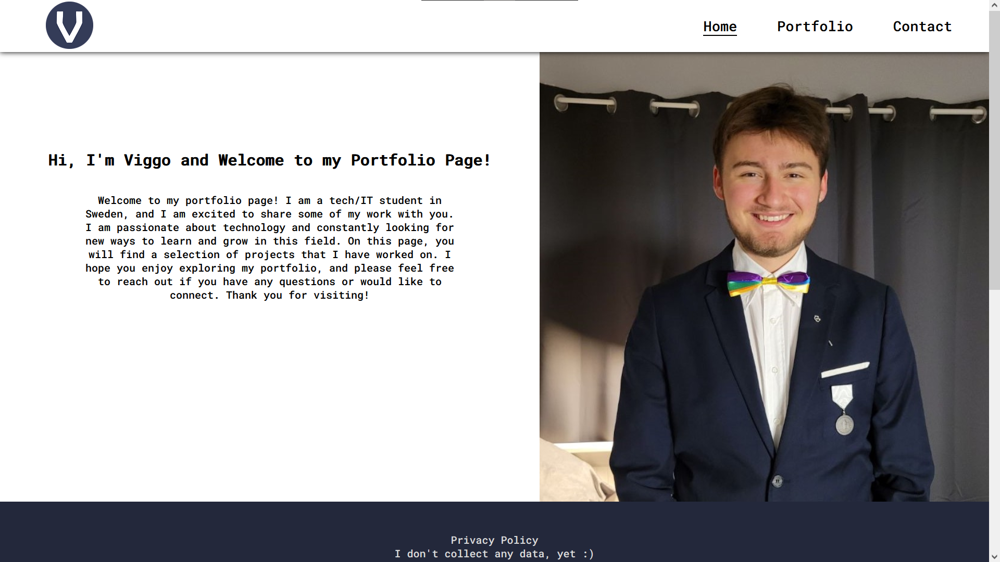

# Portfolio Page V2

Hosted on [GitHub Pages](https://viggostrom.github.io/Portfolio-Page-V2/).

## Description
This is my second attempt at making a nice, clean portfolio page. I wanted to make it more visually appealing and easier to navigate than the first version. I also wanted to make it more responsive and mobile-friendly. Which I feel like i did. The projects on the site are the ones I have made during my time at NTI Gymnasiet, Uppsala.

## Technologies
- HTML
- CSS